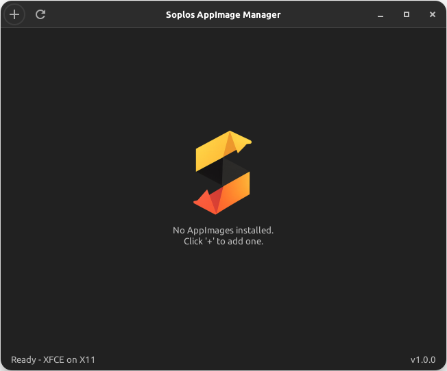
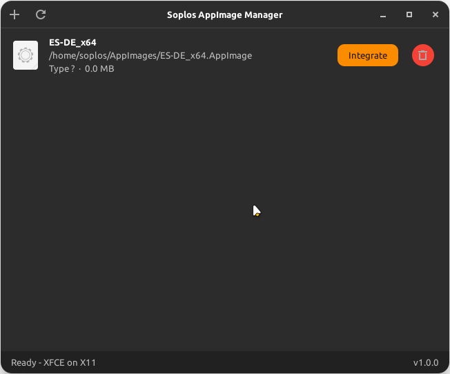
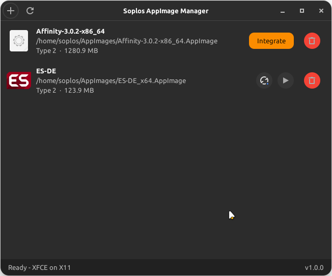
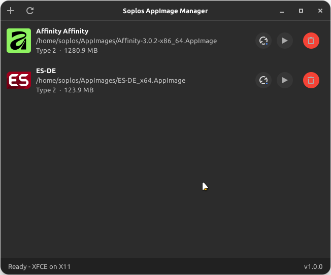

# Soplos AppImage Manager

[](https://www.gnu.org/licenses/gpl-3.0)
[]()

AppImage integration manager for Soplos Linux.

## Description

Soplos AppImage Manager lets you easily integrate AppImage applications into your Soplos Linux desktop. Select any AppImage file, and the manager moves it to `~/AppImages/`, extracts its icon and metadata, and creates a `.desktop` entry so the app appears in your application menu — no manual steps needed.

## Screenshots

<div align="center">
  
  
  
  
</div>

## Features

- **Add AppImages**: File chooser or drag & drop → moved to `~/AppImages/` automatically
- **Metadata extraction**: icon, name, version and description extracted from the AppImage itself
- **Icon storage**: icons saved persistently to `~/AppImages/.icons/`
- **Desktop integration**: `.desktop` file created in `~/.local/share/applications/`
- **Type detection**: Supports AppImage Type 1 (ISO9660) and Type 2 (SquashFS)
- **Universal detection**: recognises AppImages installed by any source (Soplos Welcome, manual placement, etc.)
- **Integrate**: one-click integration for AppImages already in `~/AppImages/`
- **Auto-refresh**: file monitor watches `~/AppImages/` and `~/.local/share/applications/` — no manual refresh needed
- **Run**: launch any managed AppImage from the manager
- **Delete**: remove the AppImage, icon and desktop entry in one click
- **Update info**: reads the update URL from the embedded `.upd_info` ELF section via `readelf`
- **Internationalisation**: ships with 8 languages (es, en, fr, de, it, pt, ro, ru)
- **Soplos UI**: consistent dark theme matching the Soplos Linux ecosystem

## Requirements

- Python 3.10+
- GTK+ 3
- python3-gi
- `p7zip-full` (recommended, for faster metadata extraction)

## Installation

Usually shipped natively with Soplos Linux. To run locally:

```bash
git clone https://github.com/SoplosLinux/soplos-appimage-manager.git
cd soplos-appimage-manager
python3 main.py
```

## Structure

```
soplos-appimage-manager/
├── assets/           # Icons, themes and desktop file
├── config/           # Constants
├── core/             # AppImage logic (integration, extraction, management)
├── debian/           # Deb packaging data
├── ui/               # GTK3 interface
└── utils/            # Environment detection
```

## How it works

1. User selects an `.AppImage` file via the file chooser
2. The file is moved to `~/AppImages/`
3. Metadata is extracted using `7zz` or `--appimage-extract`
4. The icon is saved to `~/AppImages/.icons/`
5. A `.desktop` file is written to `~/.local/share/applications/`
6. The app appears in the application menu immediately

## License

This project is licensed under the GPL-3.0 License — see the `debian/copyright` file for details.
